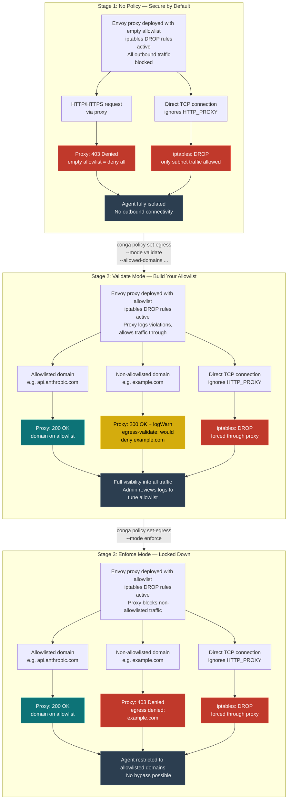
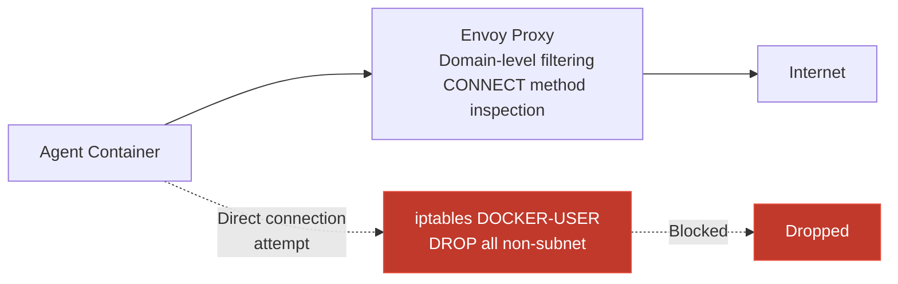

<!--
GLaDOS-MANAGED DOCUMENT
Last Updated: 2026-03-29
To modify: Edit directly.
-->

# Egress Controls — Deployment Stages & Security Scenarios

> How Conga Line restricts agent outbound network access across the three
> deployment stages. All stages apply iptables DROP rules to force traffic
> through the Envoy proxy — the proxy itself determines whether to block
> or log based on the policy mode.

## Deployment Stages

## Key Design Decisions

### iptables applied in ALL modes

iptables DROP rules are always active, regardless of egress policy mode.
Without them, tools that ignore `HTTP_PROXY`/`HTTPS_PROXY` environment
variables (direct TCP connections, `curl --noproxy`, etc.) bypass the
proxy entirely — creating blind spots in validate-mode violation logs
and enforcement gaps in enforce mode.

The proxy's Lua filter handles the mode distinction:

| Mode | Proxy Behavior | iptables Behavior |
|------|---------------|-------------------|
| **No policy** | Deny all (empty allowlist) | DROP all non-subnet traffic |
| **Validate** | Log violations, allow through | DROP all non-subnet traffic |
| **Enforce** | Block non-allowlisted (403) | DROP all non-subnet traffic |

### Defense in depth layers

Two independent enforcement layers ensure no single failure compromises
egress controls:

1. **Envoy proxy** — Application-layer filtering. Inspects CONNECT
   requests, matches domain against allowlist, applies mode-specific
   behavior (log or block).

2. **iptables DROP rules** — Network-layer enforcement. Ensures all
   outbound traffic from the agent container can only reach the local
   Docker subnet (where the proxy lives). Any direct internet-bound
   connection is dropped.

### Per-agent isolation

Each agent gets its own:
- Docker bridge network
- Envoy proxy container
- iptables rule set (keyed by container IP)

No shared proxy means one agent's compromise cannot observe or interfere
with another agent's traffic.

## Operator Workflow

```mermaid
flowchart LR
    A["Deploy agent
    conga admin add-user"] --> B["Agent starts
    deny-all egress"]
    B --> C["Set validate policy
    conga policy set-egress
    --mode validate"]
    C --> D["Deploy policy
    conga policy deploy"]
    D --> E["Run agent workload
    observe proxy logs"]
    E --> F["Review violations
    conga get-proxy-logs"]
    F -->|"Tune allowlist"| C
    F -->|"Allowlist complete"| G["Switch to enforce
    conga policy set-egress
    --mode enforce"]
    G --> H["Deploy enforce
    conga policy deploy"]
    H --> I["Agent locked down
    only allowlisted domains"]
```

